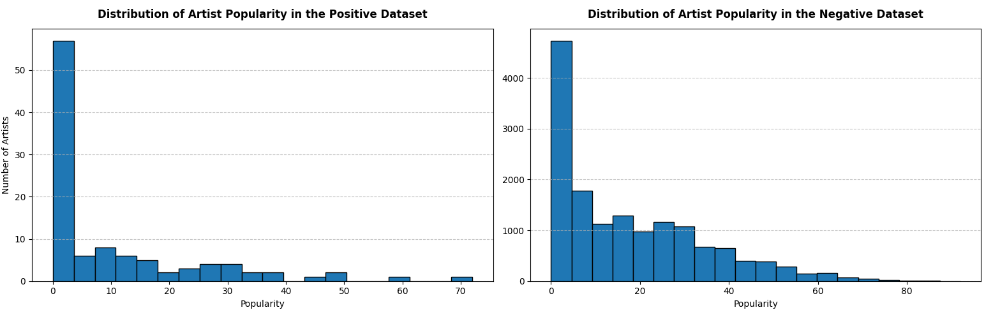

## What is it?

Streamageddon is our Data Science project that aims to identify similarities among artists who boycotted Spotify and predict whether an artist is likely to boycott Spotify in the future. The reason for this project is to raise awareness of Spotify's questionable practices, such as its CEO investing in war drones or failing to pay its artists.

## How did we approach this problem?

We collected data on ~100 artists who recently boycotted Spotify or did so in the last few years. Then we collected data on other artists who did not leave and used machine learning techniques to train the algorithm to distinguish between the two. We based our prediction on multiple factors, such as the artist's followers count, popularity rate, and genres they perform. You can read more about technical details in our tech report! (add link to the report later)

## And the results are...

Studying our datasets, we spotted a few interesting details. First, the distribution of genres between the two groups of artists was different. Among the artists who boycotted, there is a significant shift towards folk and alternative artists. You can see the difference in the plots below. The positive dataset refers to the artists who boycotted, and the negative dataset to those who did not.

Another detail we noticed is that the majority of boycotted artists have a popularity rate closer to zero. It is to be expected, because we found many small artists who boycotted when we scraped for data. The negative dataset had a smoother distribution of popularities.

But what about the prediction?

...well, our prediction results weren't so great. Our model was good at predicting whether an artist wouldn't boycott, but the classification accuracy for artists who actually left was very low (F1-score 0.13), indicating that our model was heavily biased towards artists who did not boycott. There are several possible reasons for that.

### Problems and limitations

One reason that comes to mind is the size of our dataset. It is true that many artists have been leaving Spotify lately, but not enough to provide a reliable analysis. About a hundred entries in a dataset are not enough to draw trustworthy conclusions about a group, and this is why our model might have struggled. There were many entries in the negative dataset, and our model did its best to learn patterns of the negative class but lacked sufficient information about the positive class, even with techniques that address imbalanced datasets.

Another reason for inaccurate results is incorrect preprocessing on our part. The biggest problem in our datasets was the abundance of obscure genres. We grouped most subgenres into distinct categories, but even then, many entries ended up in the "other" category, which might have affected the model's accuracy.

Another possible explanation is that it is not possible to predict how an artist will act based on external factors such as the genres they play or their follower count. The differences in the datasets we discussed earlier may be due to randomness and other external factors. The decision to leave an unethical platform lies with the individuals who represent the band and can depend on their political stance, financial status, relationships with the label, and many other personal variables that cannot be predicted using data science (at least not ethically or within our resources).

### What next?

Given the discussed limitations, it is unclear whether one can predict whether an artist is likely to boycott an unethical platform. If more artists keep leaving Spotify, the study can be conducted again with a larger dataset of boycotting bands, which might help address the problems discussed earlier. However, as of now, we recognise that current problems make this task hardly achievable with our current resources. Still, it was a fun project to work on and an interesting experience.
